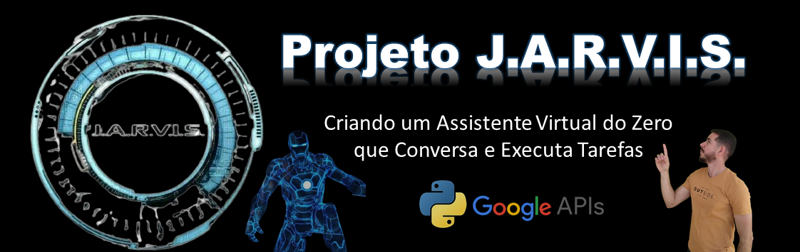

# Projeto J.A.R.V.I.S.

## Descrição

O J.A.R.V.I.S. é um assistente virtual inspirado no famoso assistente do Homem de Ferro. Desenvolvido em Python, ele utiliza tecnologias como reconhecimento de voz, síntese de fala, e integrações com APIs avançadas para realizar diversas funções, desde conversas simples até tarefas mais complexas, como buscas na web e previsão do tempo.



## Funcionalidades

- **Reconhecimento de voz:** Transforma sua fala em texto.
- **Síntese de voz (Text-to-Speech):** Responde suas perguntas e comandos em voz.
- **Integração com Google API (Gemini):** Realiza buscas na web e responde com precisão.
- **Previsão do tempo:** Informa o clima atual utilizando a API do OpenWeather.
- **Abertura de aplicativos:** Inicia programas no seu computador através de comandos de voz.
- **Transcrição de textos:** Converte arquivos de áudio em texto.

## Tecnologias Utilizadas

- **Python**
- **tkinter:** Para a interface gráfica.
- **pyttsx3:** Para a síntese de voz.
- **speech_recognition:** Para o reconhecimento de voz.
- **Google API (Gemini):** Para buscas e respostas avançadas.
- **OpenWeather API:** Para previsão do tempo.

## Como Utilizar

1. Clone o repositório:
    ```bash
    git clone https://github.com/seu-usuario/jarvis-assistente.git
    ```


## Contribuição

Contribuições são bem-vindas! Sinta-se à vontade para abrir issues e enviar pull requests. Para mudanças maiores, por favor, abra uma discussão antes para que possamos alinhar as melhorias.

## Licença

Este projeto está licenciado sob a [MIT License]

## Contato

- **LinkedIn:** [Carlos Garcia - CGS](https://www.linkedin.com/in/carlos-cgs/)

  ## Projeto Funcionando
  Segue o link para uma postagem que fiz no meu LinkedIn com video deste aplicativo funcionando: https://www.linkedin.com/feed/update/urn:li:activity:7241385354061058048/
